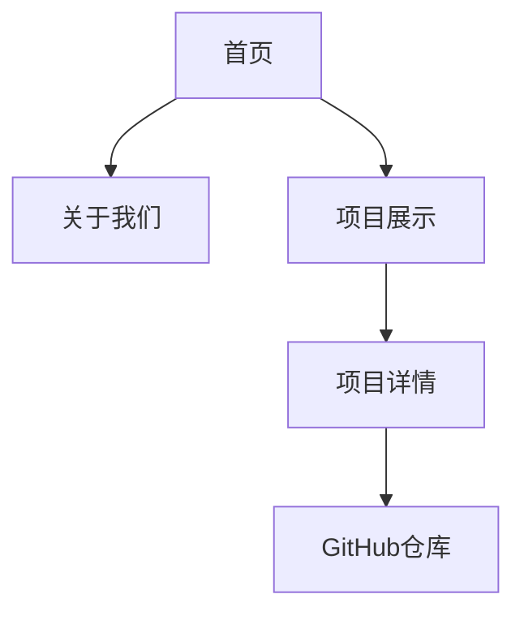

## 1. 产品概述
开源顶点组织官网是一个展示组织形象、项目成果和技术实力的极客风格网站。通过黑客帝国/终端风格的视觉设计和高科技感的交互体验，向开发者社区传达开源顶点的技术理念和创新精神。

目标用户为开发者、技术爱好者和潜在合作伙伴，网站将作为组织的数字名片，展示技术实力和开源贡献。

## 2. 核心功能

### 2.1 功能模块
网站包含以下核心页面：
1. **首页**：Hero区域、动态背景、打字机效果介绍、导航栏
2. **关于我们**：组织介绍、团队成员、技术理念
3. **项目展示**：开源项目列表、项目详情、代码仓库链接

### 2.2 页面详情

| 页面名称 | 模块名称 | 功能描述 |
|---------|---------|----------|
| 首页 | Hero区域 | 展示组织名称和标语，配合打字机效果展示技术宣言 |
| 首页 | 动态背景 | 渲染粒子系统或代码流动画，营造黑客帝国氛围 |
| 首页 | 导航栏 | 提供页面跳转功能，采用极简设计风格 |
| 关于我们 | 组织介绍 | 展示开源顶点的使命、愿景和技术追求 |
| 关于我们 | 团队成员 | 展示核心成员信息和技术专长 |
| 项目展示 | 项目列表 | 展示所有开源项目，包含项目名称、描述和技术栈 |
| 项目展示 | 项目详情 | 点击项目后展示详细信息、功能特性和使用说明 |

## 3. 核心流程
用户访问流程：
1. 用户进入首页，看到Hero区域的打字机效果和动态背景
2. 通过导航栏可以跳转到"关于我们"或"项目展示"页面
3. 在项目展示页面可以查看项目列表，点击具体项目查看详情
4. 项目详情页面提供GitHub仓库链接，方便用户访问源码

## 4. 用户界面设计

### 4.1 设计风格
- **主色调**：深黑色 (#0A0A0A) 和霓虹绿 (#00FF41)
- **辅助色**：深灰色 (#1A1A1A) 和亮绿色 (#39FF14)
- **按钮样式**：扁平化设计，悬停时发光效果
- **字体**：等宽字体 (Monaco, Consolas)，标题使用大号粗体
- **布局风格**：极简主义，大量留白，突出内容
- **图标风格**：线条图标，配合发光效果

### 4.2 页面设计概述

| 页面名称 | 模块名称 | UI元素 |
|---------|---------|--------|
| 首页 | Hero区域 | 大标题使用霓虹绿发光效果，副标题采用打字机动画，背景为黑色渐变 |
| 首页 | 动态背景 | 绿色粒子系统或代码字符雨，透明度0.3，营造深度感 |
| 首页 | 导航栏 | 顶部固定，黑色背景，链接文字为绿色，悬停时发光 |
| 关于我们 | 组织介绍 | 卡片式布局，黑色背景配绿色边框，文字为灰白色 |
| 关于我们 | 团队成员 | 网格布局，成员头像圆形带绿色光环效果 |
| 项目展示 | 项目列表 | 卡片网格布局，每个项目卡片有绿色悬停效果和轻微放大动画 |
| 项目详情 | 详情展示 | 全屏模态框，黑色背景，绿色标题，包含项目截图和描述 |

### 4.3 响应式设计
- 桌面优先设计，支持1920x1080及以上分辨率
- 平板适配：768px-1024px，调整网格布局为2列
- 手机适配：320px-767px，单列布局，简化动画效果
- 触摸优化：增大点击区域，简化悬停效果

### 4.4 动画效果指导
- 打字机效果：每个字符显示间隔50ms，光标闪烁频率1Hz
- 粒子动画：粒子数量控制在100-200个，移动速度适中
- 页面切换：使用淡入淡出效果，持续时间300ms
- 悬停效果：发光强度从0到100%的过渡，时间200ms
- 滚动动画：元素进入视口时触发，使用缓动函数