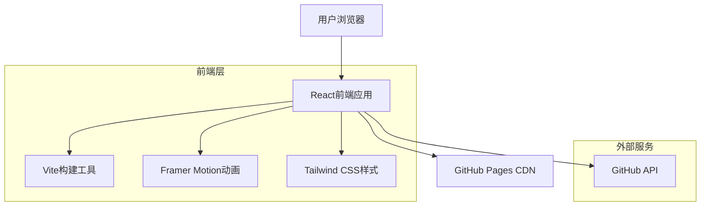

## 1. 架构设计



## 2. 技术描述

- **前端框架**: React@18 + TypeScript
- **构建工具**: Vite@5
- **样式框架**: Tailwind CSS@3
- **动画库**: Framer Motion@11
- **图标库**: Lucide React
- **部署平台**: GitHub Pages
- **初始化工具**: vite-init

## 3. 路由定义

| 路由 | 用途 |
|-----|------|
| / | 首页，展示Hero区域和组织介绍 |
| /about | 关于我们页面，详细介绍组织信息 |
| /projects | 项目展示页面，列出所有开源项目 |
| /projects/:id | 项目详情页面，展示具体项目信息 |

## 4. 组件架构

### 4.1 核心组件

```typescript
// 主应用组件
interface AppProps {
  basename?: string;
}

// Hero区域组件
interface HeroSectionProps {
  title: string;
  subtitle: string;
  typingSpeed?: number;
}

// 项目卡片组件
interface ProjectCardProps {
  id: string;
  name: string;
  description: string;
  language: string;
  stars: number;
  url: string;
}

// 团队成员组件
interface TeamMemberProps {
  name: string;
  role: string;
  avatar: string;
  github: string;
}
```

### 4.2 动画配置

```typescript
// 打字机效果配置
interface TypingAnimationConfig {
  text: string;
  speed: number; // 字符显示间隔(ms)
  cursorBlinkSpeed: number; // 光标闪烁速度(ms)
}

// 粒子系统配置
interface ParticleConfig {
  count: number; // 粒子数量
  speed: number; // 移动速度
  color: string; // 粒子颜色
  opacity: number; // 透明度
}

// 页面过渡动画
interface PageTransitionConfig {
  duration: number; // 动画持续时间(ms)
  easing: string; // 缓动函数
  delay?: number; // 延迟时间(ms)
}
```

## 5. 性能优化

### 5.1 代码分割
- 使用React.lazy进行路由级别的代码分割
- 组件级别的动态导入
- 第三方库按需加载

### 5.2 资源优化
- 图片使用WebP格式
- 字体文件子集化
- CSS和JS文件压缩
- 启用Gzip压缩

### 5.3 缓存策略
- 静态资源设置长期缓存
- 使用Service Worker进行离线缓存
- GitHub Pages的CDN缓存利用

## 6. 部署配置

### 6.1 GitHub Actions工作流

```yaml
name: Deploy to GitHub Pages
on:
  push:
    branches: [ main ]
jobs:
  build-and-deploy:
    runs-on: ubuntu-latest
    steps:
    - uses: actions/checkout@v3
    - name: Setup Node.js
      uses: actions/setup-node@v3
      with:
        node-version: '18'
    - name: Install dependencies
      run: npm ci
    - name: Build
      run: npm run build
    - name: Deploy
      uses: peaceiris/actions-gh-pages@v3
      with:
        github_token: ${{ secrets.GITHUB_TOKEN }}
        publish_dir: ./dist
```

### 6.2 Vite配置

```typescript
// vite.config.ts
import { defineConfig } from 'vite'
import react from '@vitejs/plugin-react'

export default defineConfig({
  plugins: [react()],
  base: '/openvertex.github.io/',
  build: {
    outDir: 'dist',
    assetsDir: 'assets',
    sourcemap: true,
    rollupOptions: {
      output: {
        manualChunks: {
          'react-vendor': ['react', 'react-dom'],
          'animation-vendor': ['framer-motion'],
          'ui-vendor': ['lucide-react']
        }
      }
    }
  },
  optimizeDeps: {
    include: ['react', 'react-dom', 'framer-motion']
  }
})
```

## 7. 开发环境配置

### 7.1 环境变量

```bash
# .env.development
VITE_APP_NAME=OpenVertex
VITE_GITHUB_ORG=OpenVertex
VITE_API_BASE_URL=https://api.github.com

# .env.production
VITE_APP_NAME=OpenVertex
VITE_GITHUB_ORG=OpenVertex
VITE_API_BASE_URL=https://api.github.com
```

### 7.2 开发脚本

```json
{
  "scripts": {
    "dev": "vite",
    "build": "tsc && vite build",
    "preview": "vite preview",
    "lint": "eslint . --ext ts,tsx --report-unused-disable-directives --max-warnings 0",
    "type-check": "tsc --noEmit"
  }
}
```

## 8. 浏览器兼容性

- Chrome >= 90
- Firefox >= 88
- Safari >= 14
- Edge >= 90
- 移动端浏览器：iOS Safari >= 14, Chrome Android >= 90